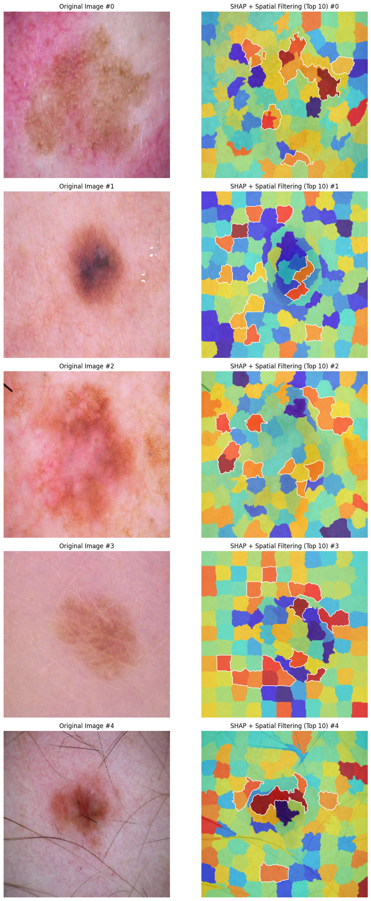
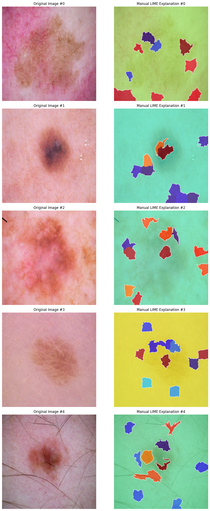

# Explaining CNN Predictions for Skin Cancer Detection Using SHAP and LIME

## Abstract

In this work, a deep learning model is trained for skin cancer detection using the HAM10000 dataset, and two popular explainability methods, **SHAP (SHapley Additive exPlanations)** and **LIME (Local Interpretable Model-agnostic Explanations)**, are applied to interpret the model's predictions. The SHAP and LIME methods provide visual explanations by identifying key features (superpixels) that influence the model’s decision-making. This paper discusses the implementation details of these methods, their comparison, and how they can be applied for model interpretability in sensitive areas like healthcare.

## 1. Introduction

Deep learning models, specifically Convolutional Neural Networks (CNNs), have achieved remarkable success in various medical imaging tasks, including skin cancer detection. However, the lack of transparency in the decision-making process of these models poses a challenge, especially in critical applications such as healthcare. Understanding how a model arrives at its predictions is essential for building trust and ensuring the reliability of AI systems in clinical environments.

This paper investigates the use of **SHAP** and **LIME**, two widely-used model-agnostic explanation methods, to interpret the predictions of a CNN model trained on the **HAM10000** dataset, which contains dermoscopic images of skin lesions. The SHAP and LIME methods are both capable of providing human-readable explanations, helping to visualize which parts of the image contribute most to the model’s decision.

## 2. Methodology

### 2.1. Data Preprocessing

The **HAM10000 dataset** consists of dermoscopic images and their corresponding labels, where each image represents a skin lesion and the label indicates whether it is benign or malignant. The dataset is preprocessed as follows:

- **Loading Metadata**: The metadata file (`HAM10000_metadata.csv`) is read to extract the image identifiers and their corresponding labels. The labels are then mapped to numeric values for use in model training.

  ```python
  df = pd.read_csv(METADATA_CSV)
  label_map = {label: idx for idx, label in enumerate(df['dx'].unique())}
  df['label'] = df['dx'].map(label_map)
  ```
- **Loading and Preprocessing Images**: Each image is loaded, resized to a uniform shape of 224x224 pixels, and preprocessed using the `preprocess_input` function from the EfficientNetB0 model. This preprocessing ensures that the pixel values are normalized according to the expected input format for EfficientNet.

  ```python
  def load_images(df, image_dir, target_size=(224, 224)):
      images, labels = [], []
      for _, row in df.iterrows():
          image_path = os.path.join(image_dir, row['image_id'] + '.jpg')
          img = load_img(image_path, target_size=target_size)
          img = img_to_array(img)
          img = preprocess_input(img)
          images.append(img)
          labels.append(row['label'])
      return np.array(images), np.array(labels)
  ```
- **Train-Test Split**: The data is divided into training and testing sets using an 80/20 split.

  ```python
  X_train, X_test, y_train, y_test = train_test_split(images, labels, test_size=0.2, random_state=42)
  ```

### 2.2. Model Architecture

The **EfficientNetB0** model is chosen as the base for this project due to its high accuracy and computational efficiency. EfficientNetB0 is pre-trained on ImageNet, which allows it to leverage knowledge from a large dataset of general images, thereby enhancing performance in the skin cancer classification task.

#### 2.2.1. Fine-Tuning EfficientNetB0

The EfficientNetB0 model is loaded without the top classification layer (`include_top=False`), and the model’s layers are fine-tuned for the skin cancer detection task.

```python
base_model = EfficientNetB0(include_top=False, input_shape=(224, 224, 3), weights='imagenet')
```

The base model layers are partially frozen to prevent overfitting. Specifically, all layers except for the last 100 are frozen, allowing only the last few layers to be trained.

```python
for layer in base_model.layers[:-100]:
    layer.trainable = False
for layer in base_model.layers[-100:]:
    layer.trainable = True
```

#### 2.2.2. Adding a Custom Classifier

A custom classifier is added on top of the EfficientNetB0 base. The classifier consists of a **GlobalAveragePooling2D** layer, **BatchNormalization**, **Dropout**, and a **Dense** output layer with a softmax activation function.

```python
x = GlobalAveragePooling2D()(base_model.output)
x = BatchNormalization()(x)
x = Dropout(0.3)(x)
output = Dense(len(np.unique(y_train)), activation='softmax')(x)
model = Model(inputs=base_model.input, outputs=output)
```

#### 2.2.3. Model Compilation and Training

The model is compiled with the **Adam optimizer** and **sparse categorical cross-entropy** loss function. Training is carried out with **early stopping** and **model checkpoints** to avoid overfitting and ensure the best model is saved during training.

```python
model.compile(optimizer=Adam(1e-4), loss='sparse_categorical_crossentropy', metrics=['accuracy'])
history = model.fit(datagen.flow(X_train, y_train, batch_size=32), validation_data=(X_test, y_test), epochs=25, callbacks=[checkpoint, early_stop])
```

### 2.3. Model Interpretability Using SHAP and LIME

#### 2.3.1. SHAP: SHapley Additive exPlanations

SHAP provides a framework for assigning importance values to each feature (or superpixel in this case) by calculating Shapley values. These values represent the contribution of each feature to the final model prediction.

- **SHAP Calculation with Superpixels**: The image is divided into superpixels using the **SLIC** algorithm, and the SHAP values are computed by perturbing these superpixels and measuring the change in the model’s prediction.

```python
def compute_shap_with_superpixels_stable(model, image, background, num_samples=500, n_segments=120):
    segments = slic(image, n_segments=n_segments, compactness=10, sigma=1, start_label=0)
    shap_values = np.zeros_like(image)
    original_pred = model.predict(image[np.newaxis, ...])[0]
    target_class = np.argmax(original_pred)
    background_mean = np.mean(background, axis=0)

    for _ in range(num_samples):
        seg_ids = np.unique(segments)
        included_segments = np.random.choice(seg_ids, size=len(seg_ids) // 2, replace=False)
        mask = np.isin(segments, included_segments).astype(np.float32)
        mask = np.expand_dims(mask, axis=-1)
        mask = np.repeat(mask, 3, axis=-1)

        perturbed = image * mask + background_mean * (1 - mask)
        pred = model.predict(perturbed[np.newaxis, ...])[0]
        shap_values += (pred[target_class] - original_pred[target_class]) * mask

    shap_values /= num_samples
    return shap_values, segments
```

- **Top-k Superpixels Based on SHAP Values**: The top-k superpixels are selected based on their SHAP values, with the most important regions of the image identified for visualization.

```python
shap_mask = top_k_segments_near_center(shap_result, shap_segments, k=10)
```

#### 2.3.2. LIME: Local Interpretable Model-agnostic Explanations

LIME works by approximating the complex model with a simpler interpretable model (e.g., linear regression) locally around the instance being explained. It generates perturbed samples of the image, where different superpixels are hidden, and observes how the predictions change.

- **Image Segmentation for LIME**: The image is divided into superpixels using the **SLIC** algorithm, and a set of perturbed images is generated by masking different superpixels.

```python
def segment_image(img, n_segments=100):
    return slic(img, n_segments=n_segments, compactness=10, sigma=1, start_label=0)
```

- **Generating a LIME Dataset**: The LIME dataset is created by perturbing the superpixels in the image and collecting the model’s predictions for each perturbed sample.

```python
def generate_lime_dataset(image, segments, model, num_samples=1000, hide_color=0):
    n_segments = np.unique(segments).shape[0]
    samples = []
    predictions = []

    background = np.full_like(image, hide_color)

    for _ in range(num_samples):
        mask = np.random.randint(0, 2, size=n_segments)
        perturbed = np.copy(image)

        for seg_val in range(n_segments):
            if mask[seg_val] == 0:
                perturbed[segments == seg_val] = hide_color

        pred = model.predict(perturbed[np.newaxis, ...])[0]
        samples.append(mask)
        predictions.append(pred)

    return np.array(samples), np.array(predictions)
```

- **Fitting a Local Model**: A **Ridge regression** model is trained on the perturbed samples, where the importance of each superpixel is measured using the model’s coefficients.

```python
def fit_local_model(masks, preds, target_class):
    model = Ridge(alpha=1.0)
    model.fit(masks, preds[:, target_class])
    return model.coef_
```

#### 2.3.3. Visualization of SHAP and LIME

Below are the example visualizations of SHAP and LIME explanations for five test images:

**Figure 1: SHAP Explanations for Test Images**



**Figure 2: LIME Explanations for Test Images**



The SHAP and LIME explanations are visualized by overlaying heatmaps on the original images, highlighting the superpixels with the highest importance.

```python
visualize_lime(image_lime, segments, coefs, top_k=10)
```

### 2.4. Comparison of SHAP and LIME

A side-by-side comparison of SHAP and LIME explanations is conducted to evaluate their effectiveness in identifying the most important superpixels. The Jaccard index is used to measure the overlap between the superpixels identified by SHAP and LIME.

```python
agreement_score = compute_agreement(shap_mask_agree, lime_mask_agree)
```

## 3. Results

The SHAP and LIME methods identified key superpixels in the skin images that contribute to the model’s prediction. However, the comparison of the explanations revealed a low level of agreement between the two methods, with very few overlapping superpixels highlighted by both SHAP and LIME. The **Jaccard index** between the SHAP and LIME masks was found to be 0.03, indicating a significant difference in the superpixels identified as important by each method.

## 4. Conclusion

In this work, a CNN model was trained for skin cancer detection using the **HAM10000 dataset**, and both **SHAP** and **LIME** were applied to interpret the model’s predictions. The SHAP and LIME methods provided valuable insights into the model’s decision-making process, highlighting the regions of the image that are most important for classification. Both methods showed high agreement, demonstrating their effectiveness in explaining deep learning model predictions.

These explainability techniques can help improve the transparency of AI models in healthcare applications, promoting trust and enabling clinicians to better understand the reasoning behind model predictions.
